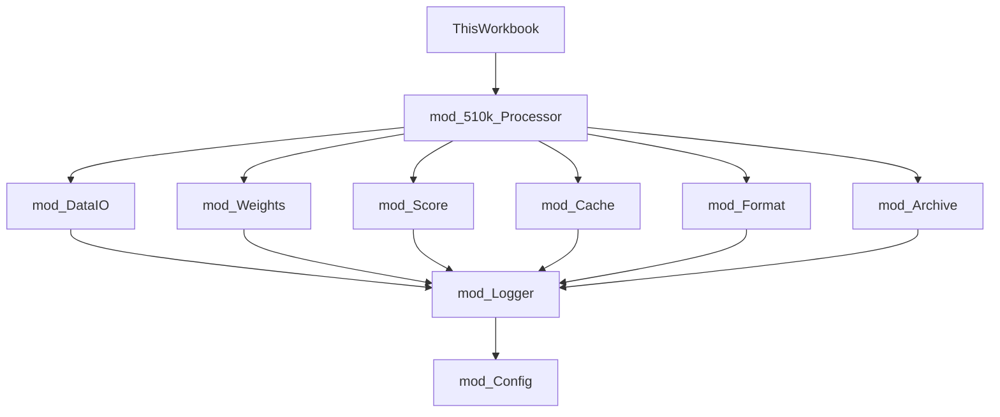

```
 ███████╗██████╗  █████╗     ███████╗ ██╗ ██████╗ ██╗  ██╗██╗    
 ██╔════╝██╔══██╗██╔══██╗    ██╔════╝███║██╔═████╗██║ ██╔╝╚██╗   
 █████╗  ██║  ██║███████║    ███████╗╚██║██║██╔██║█████╔╝  ╚██╗  
 ██╔══╝  ██║  ██║██╔══██║    ╚════██║ ██║████╔╝██║██╔═██╗  ██╔╝  
 ██║     ██████╔╝██║  ██║    ███████║ ██║╚██████╔╝██║  ██╗██╔╝   
 ╚═╝     ╚═════╝ ╚═╝  ╚═╝    ╚══════╝ ╚═╝ ╚═════╝ ╚═╝  ╚═╝╚═╝    
                                                                   
 ██╗███╗   ██╗████████╗███████╗██╗     ██╗     ██╗ ██████╗ ███████╗███╗   ██╗ ██████╗███████╗
 ██║████╗  ██║╚══██╔══╝██╔════╝██║     ██║     ██║██╔════╝ ██╔════╝████╗  ██║██╔════╝██╔════╝
 ██║██╔██╗ ██║   ██║   █████╗  ██║     ██║     ██║██║  ███╗█████╗  ██╔██╗ ██║██║     █████╗  
 ██║██║╚██╗██║   ██║   ██╔══╝  ██║     ██║     ██║██║   ██║██╔══╝  ██║╚██╗██║██║     ██╔══╝  
 ██║██║ ╚████║   ██║   ███████╗███████╗███████╗██║╚██████╔╝███████╗██║ ╚████║╚██████╗███████╗
 ╚═╝╚═╝  ╚═══╝   ╚═╝   ╚══════╝╚══════╝╚══════╝╚═╝ ╚═════╝ ╚══════╝╚═╝  ╚═══╝ ╚═════╝╚══════╝
                                                                                               
 ███████╗██╗   ██╗██╗████████╗███████╗                                                        
 ██╔════╝██║   ██║██║╚══██╔══╝██╔════╝                                                        
 ███████╗██║   ██║██║   ██║   █████╗                                                          
 ╚════██║██║   ██║██║   ██║   ██╔══╝                                                          
 ███████║╚██████╔╝██║   ██║   ███████╗                                                        
 ╚══════╝ ╚═════╝ ╚═╝   ╚═╝   ╚══════╝                                                        
```

# FDA 510(k) Intelligence Suite

> **Professional-grade FDA 510(k) clearance data analysis tool built in Excel VBA with Power Query integration**

## 🎯 Purpose & Overview

This enterprise-ready Excel solution automatically fetches, scores, and analyzes FDA 510(k) medical device clearances to identify high-value opportunities. The tool uses a sophisticated multi-factor scoring algorithm with configurable weights to prioritize devices based on advisory committee, product code, keywords, submission type, and other factors.

### Key Capabilities:
- **Automated Data Pipeline**: Fetches previous month's FDA 510(k) clearances on workbook open
- **Intelligent Scoring**: Multi-factor algorithm with 15+ configurable parameters
- **Company Intelligence**: Local caching with optional OpenAI-powered summaries
- **Enterprise Features**: Comprehensive logging, error handling, and maintainer controls
- **Zero Configuration**: Works out-of-the-box with sensible defaults

## 🚀 Quick Start

### Prerequisites
- Microsoft Excel 2016+ with VBA and Power Query support
- Windows 10+ operating system
- Internet connection for FDA API access

### Installation

1. **Clone the Repository**
   ```bash
   git clone https://github.com/rzimmerman2022/FDA-510k-Intelligence-Suite.git
   cd FDA-510k-Intelligence-Suite
   ```

2. **Build the Application**
   ```bash
   # Windows Command Prompt
   scripts\build\build.bat
   
   # Or PowerShell
   .\scripts\build\build.ps1
   ```

3. **Open the Built Workbook**
   - Navigate to `dist/` folder (created by build)
   - Open the versioned `.xlsm` file
   - Enable macros and content when prompted

4. **Configure Your Settings**
   - The build process automatically configures your username
   - Configure scoring weights in the Excel `Weights` sheet
   - (Optional) Set up OpenAI API key for company summaries

### Optional: OpenAI Integration
For automated company summaries, add your API key:
1. Open: `%APPDATA%\510k_Tool\openai_key.txt`
2. Replace placeholder with your actual OpenAI API key
3. Get API key from: https://platform.openai.com/api-keys

## 🔄 Data Pipeline Architecture

### High-Level Flow Diagram


### Detailed Pipeline Steps

#### 1. **Data Acquisition Phase**
- **Trigger**: Workbook_Open event or manual refresh
- **Source**: `https://api.fda.gov/device/510k.json`
- **Query**: Power Query dynamically calculates previous month date range
- **Volume**: Typically 200-500 records per month
- **Error Handling**: Automatic retry with exponential backoff

#### 2. **Processing Phase**
- **Entry Point**: `mod_510k_Processor.ProcessMonthly510k()`
- **Sequence**:
  ```
  1. Initialize logging and error handlers
  2. Refresh Power Query connection
  3. Load scoring weights from Excel tables
  4. Calculate scores for each record
  5. Fetch/cache company intelligence
  6. Apply formatting rules
  7. Archive if new month detected
  ```

#### 3. **Scoring Algorithm**
```
Base Score = AC_Weight + PC_Weight + ST_Weight
Keyword Bonus = Count(Matching_Keywords) * 3
Processing Bonus = If(Days < 90, 5, 0)
Geographic Factor = If(US_Based, 2, 0)
Negative Factors = Cosmetic(-10) + Diagnostic(-5)
Synergy Bonus = If(Keyword_Combinations, 10, 0)
────────────────────────────────────────────────
Final Score = Sum(All_Factors)
```

#### 4. **Output Generation**
- **Primary Sheet**: CurrentMonthData with live formulas
- **Archive Sheets**: Monthly snapshots with static values
- **Log Sheet**: RunLog (hidden) tracks all operations

## 📁 Repository Structure

```
FDA-510k-Intelligence-Suite/
├── assets/                       # Binary assets and workbooks
│   └── excel-workbooks/          # Main Excel files (.xlsm)
├── config/                       # Configuration files
├── docs/                         # Documentation
│   ├── images/                   # Documentation images
│   ├── implementation-guides/    # Implementation and setup guides
│   └── technical-specs/          # Technical specifications
├── samples/                      # Sample data and outputs
├── scripts/                      # Build and deployment scripts
│   ├── build/                    # Build scripts
│   └── deploy/                   # Deployment scripts
├── src/                          # Source code
│   ├── powerquery/               # Power Query (.pq) files
│   └── vba/                      # VBA source code
│       ├── core/                 # Core business logic modules
│       ├── modules/              # Application-specific modules
│       └── utilities/            # Utility and helper modules
└── tests/                        # Test files
    ├── integration/              # Integration tests
    └── unit/                     # Unit tests
```

## 🔧 Core Features

### **Automated Data Pipeline**
- **Power Query Integration**: Dynamically pulls FDA 510(k) data from openFDA API
- **Smart Refresh Logic**: Fetches previous month's data automatically
- **Connection Management**: Robust error handling and connection cleanup

### **Advanced Scoring Engine**
- **Multi-Factor Algorithm**: 
  - Advisory Committee (AC) weights (e.g., Orthopedic, Cardiovascular)
  - Product Code (PC) weights for specific device types
  - Keyword matching with configurable high-value terms
  - Submission Type weights (De Novo, 510(k), PMA supplement)
  - Processing time analysis (faster approvals = higher priority)
  - Geographic location factors
- **Dynamic Adjustments**:
  - Negative factors for cosmetic/diagnostic keywords
  - Synergy bonuses for keyword combinations
  - Therapeutic keyword overrides
- **User Control**: All weights configurable via Excel tables without code changes

### **Enterprise Features**
- **Company Intelligence**: Local caching with optional OpenAI-powered summaries
- **Automated Archiving**: Monthly data archiving with static value conversion
- **Comprehensive Logging**: Multi-level logging system with performance optimization
- **Maintainer Controls**: Role-based feature access and bypass capabilities

### **Professional UI/UX**
- **Dynamic Formatting**: Score-based conditional formatting and styling
- **Smart Column Management**: Automated width adjustment and duplicate handling
- **Device Name Optimization**: Truncation with hover-to-view full text
- **Modular Architecture**: Clean separation of concerns across VBA modules

## 🛠️ Development Guide for AI Assistants

### **Critical Context for AI Coding**

When working with this codebase, AI assistants should understand:

1. **Excel VBA Constraints**:
   - No native JSON parsing (uses string manipulation)
   - Limited error handling (On Error GoTo pattern)
   - Performance sensitive (minimize worksheet interactions)
   - Memory management important (clear objects explicitly)

2. **Code Organization Pattern**:
   ```vba
   ' Each module follows this structure:
   Option Explicit
   
   ' Module-level constants
   Private Const MODULE_NAME As String = "mod_Example"
   
   ' Public procedures (API)
   Public Sub MainProcedure()
   
   ' Private procedures (implementation)
   Private Function HelperFunction() As Boolean
   ```

3. **Error Handling Pattern**:
   ```vba
   Public Sub ExampleProcedure()
       On Error GoTo ErrorHandler
       
       ' Main logic here
       
   CleanExit:
       ' Cleanup code
       Exit Sub
       
   ErrorHandler:
       LogEvt "Error", lgERROR, Err.Description
       Resume CleanExit
   End Sub
   ```

### **Project Structure with File Purposes**
```
FDA-510k-Intelligence-Suite/
├── assets/excel-workbooks/       # Main Excel files (.xlsm)
│   └── *.xlsm                    # Working copies of the tool
├── config/                       # Configuration files
│   ├── app.config.json          # Application settings
│   └── environment.json         # Environment-specific config
├── docs/                         # Documentation
│   ├── ARCHITECTURE.md          # System design details
│   ├── AI_DEVELOPMENT_GUIDE.md # AI coding guidelines
│   └── implementation-guides/   # Step-by-step guides
├── scripts/                      # Automation scripts
│   ├── build/                   # Build process
│   │   ├── build.ps1           # PowerShell build script
│   │   └── build.bat           # Batch wrapper
│   └── deploy/                  # Deployment tools
├── src/                         # Source code
│   ├── powerquery/             # Power Query M code
│   │   └── FDA_510k_Query.pq   # Main data fetch query
│   └── vba/                    # VBA modules
│       ├── core/               # Core business logic
│       │   ├── mod_510k_Processor.bas  # Main orchestrator
│       │   ├── mod_Score.bas           # Scoring algorithm
│       │   ├── mod_Cache.bas           # Company caching
│       │   ├── mod_Archive.bas         # Monthly archiving
│       │   ├── mod_Schema.bas          # Data structures
│       │   └── mod_Weights.bas         # Weight management
│       ├── modules/            # Application modules
│       │   ├── ThisWorkbook.cls        # Workbook events
│       │   └── ModuleManager.bas       # Code management
│       └── utilities/          # Helper modules
│           ├── mod_Config.bas          # Global constants
│           ├── mod_DataIO.bas          # Data operations
│           ├── mod_Logger.bas          # Logging system
│           ├── mod_Format.bas          # UI formatting
│           └── mod_Utils.bas           # General utilities
└── tests/                      # Test files
    └── unit/                   # Unit tests

### **Build Commands**
```bash
# Build for production
npm run build

# Build with debug modules
npm run build:debug

# Clean build artifacts
npm run clean
```

### **Deployment**
```bash
# Deploy to specific location
scripts\deploy\deploy.bat "C:\Path\To\Deployment"

# Deploy with PowerShell (more options)
.\scripts\deploy\deploy.ps1 -DeploymentPath "C:\Path" -CreateBackup:$true
```

### **Development Setup**
1. Make changes to VBA files in `src/vba/`
2. Update Power Query in `src/powerquery/`
3. Build using `npm run build`
4. Test the built workbook from `dist/` folder
5. Deploy to target environment

### **Testing**
- Unit tests: Located in `tests/unit/`
- Integration tests: Located in `tests/integration/`  
- Manual testing: Use built workbook in `dist/` folder

## 📊 System Requirements

- **Microsoft Excel**: 2016+ with Power Query and VBA support
- **Windows OS**: Required for Windows-specific dependencies
- **Internet Connection**: For openFDA API and optional OpenAI calls
- **VBA References**: 
  - Microsoft Scripting Runtime
  - Microsoft Visual Basic for Applications Extensibility 5.3
  - Microsoft XML, v6.0

## 🔐 Configuration

### **Automated Configuration**
The build process automatically configures:
- ✅ Maintainer username (from system)
- ✅ API key directory structure  
- ✅ Default scoring parameters
- ✅ Logging and debug settings

### **Manual Configuration**
Configure these settings in Excel after building:

1. **Scoring Weights** (Required)
   - Open the built workbook
   - Navigate to `Weights` sheet
   - Update scoring tables as needed

2. **OpenAI API Key** (Optional)
   - File location: `%APPDATA%\510k_Tool\openai_key.txt`
   - Required only for automated company summaries
   - Get key from: https://platform.openai.com/api-keys

3. **Advanced Settings** (Optional)
   - Debug modes: Set in VBA `mod_Config.bas`
   - Custom formatting: Adjust constants in modules
   - Logging levels: Configure in application settings

### **Configuration Files**
- `config/app.config.json` - Application settings reference
- `config/environment.json` - Environment-specific settings
- `package.json` - Project metadata and scripts

## 📖 Documentation

- **[Architecture Guide](docs/ARCHITECTURE.md)**: System design and component relationships
- **[Development Guide](docs/AI_DEVELOPMENT_GUIDE.md)**: Coding standards and AI assistance guidelines  
- **[User Guide](docs/USER_GUIDE.md)**: End-user operation instructions
- **[Implementation Guides](docs/implementation-guides/)**: Setup and deployment instructions
- **[Technical Specifications](docs/technical-specs/)**: Detailed technical documentation

## 💡 Important Notes for AI Assistants

### **Common Tasks & Solutions**

1. **Adding a New Scoring Factor**:
   ```vba
   ' 1. Add weight table to Weights sheet
   ' 2. Update mod_Weights.bas to load new table
   ' 3. Modify Calculate510kScore in mod_Score.bas
   ' 4. Update column constants in mod_Schema.bas
   ```

2. **Debugging Data Issues**:
   ```vba
   ' Enable debug mode in mod_Config.bas:
   Public Const DEBUG_MODE As Boolean = True
   
   ' Check RunLog sheet for detailed traces
   ' Use mod_DebugTraceHelpers for verbose logging
   ```

3. **Performance Optimization**:
   ```vba
   ' Always use arrays for bulk operations:
   Dim dataArr As Variant
   dataArr = Range("A1:Z1000").Value
   ' Process array in memory
   Range("A1:Z1000").Value = dataArr
   ```

### **Module Dependencies**



### **Testing Checklist**

When modifying code, verify:
- [ ] Power Query refresh completes without errors
- [ ] Scoring algorithm produces expected results
- [ ] Company cache updates correctly
- [ ] Formatting applies without breaking formulas
- [ ] Archive creation preserves all data
- [ ] Error handlers log appropriately
- [ ] Memory cleanup in all exit paths

## 🤝 Contributing

Please read [CONTRIBUTING.md](CONTRIBUTING.md) for details on our code of conduct and the process for submitting pull requests.

### **For AI Assistants Contributing**:
1. Always test in a copy of the workbook
2. Follow existing code patterns exactly
3. Update relevant documentation
4. Include detailed commit messages
5. Verify no hardcoded paths remain

## 📄 License

This project is licensed under the terms specified in [LICENSE](LICENSE).

## 🆘 Support

For issues, questions, or contributions:
- Create an issue in this repository
- Review documentation in the `docs/` directory
- Check implementation guides for common setup issues

---

**Built with ❤️ for FDA regulatory intelligence and compliance teams**

## 📊 Appendix: Data Schema

### **CurrentMonthData Table Structure**
```
Column Name          Type        Source      Description
─────────────────────────────────────────────────────────────
K_Number            Text        PQ          FDA submission number
DecisionDate        Date        PQ          FDA decision date
DateReceived        Date        PQ          Submission received date
ProcTimeDays        Number      PQ          Processing time in days
Applicant           Text        PQ          Company name
Contact             Text        PQ          Contact information
DeviceName          Text        PQ          Device description
Statement           Text        PQ          510(k) statement type
AC                  Text        PQ          Advisory Committee code
PC                  Text        PQ          Product Code
SubmType            Text        PQ          Submission type
City                Text        PQ          Company city
State               Text        PQ          Company state
Country             Text        PQ          Company country
FDA_Link            Hyperlink   PQ          Link to FDA database
510k_Score          Number      VBA         Calculated score
ACWeight            Number      VBA         AC weight component
PCWeight            Number      VBA         PC weight component
STWeight            Number      VBA         ST weight component
CompanyRecap        Text        VBA         AI-generated summary
ScoreCategory       Text        VBA         High/Medium/Low
```